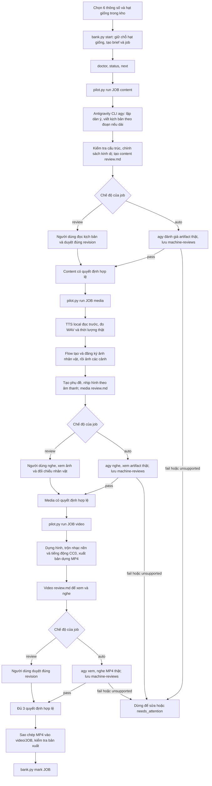

# Luồng tự động làm video truyện kinh dị — 24/09/2026

**Chỗ xem thử.** `agy --help` không liệt kê lệnh `preview`. `agy` được gọi để viết kịch bản và đánh giá trong chế độ `auto`. Mỗi mốc có `runs/<job>/reviews/<phần>/<revision>/review.md` dẫn tới artifact cần xem/nghe. Trang [nghe thử giọng](voice-audition-20260924/index.html) là thử nghiệm độc lập, không phải cổng duyệt của job. `python3 sound.py preview ID OUT.wav` chỉ tạo mẫu nghe một âm thanh nền/hiệu ứng CC0.

**Trạng thái hiện tại.** `thu-5p-h007g` là job `review` 4–6 phút, 16:9, hạt giống H007 đang giữ chỗ. Kịch bản đã có quyết định; [media revision 1](../runs/thu-5p-h007g/reviews/media/1/review.md) có WAV 298,93 giây và 22 ảnh nhưng chưa có quyết định duyệt media. Chưa có MP4 trong `video/`. Các job thử cũ hiện bị `Protected implementation changed` vì mã và cấu hình TTS đang thay đổi; không sửa integrity baseline để chạy tiếp. `doctor` nhận diện `agy`, công cụ dựng video và môi trường Gwen TTS, nhưng vẫn báo `machine_review_media_verified=false`, nên chưa thể coi nhánh tự duyệt media/video đã nghiệm thu.

Nguồn quy trình: [workflow.md](../docs/workflow.md), [horror.md](../docs/horror.md), [vp-horror](../../.agents/skills/vp-horror/SKILL.md), [workflow.py](../workflow.py), [agy_pipeline.py](../scripts/agy_pipeline.py).
